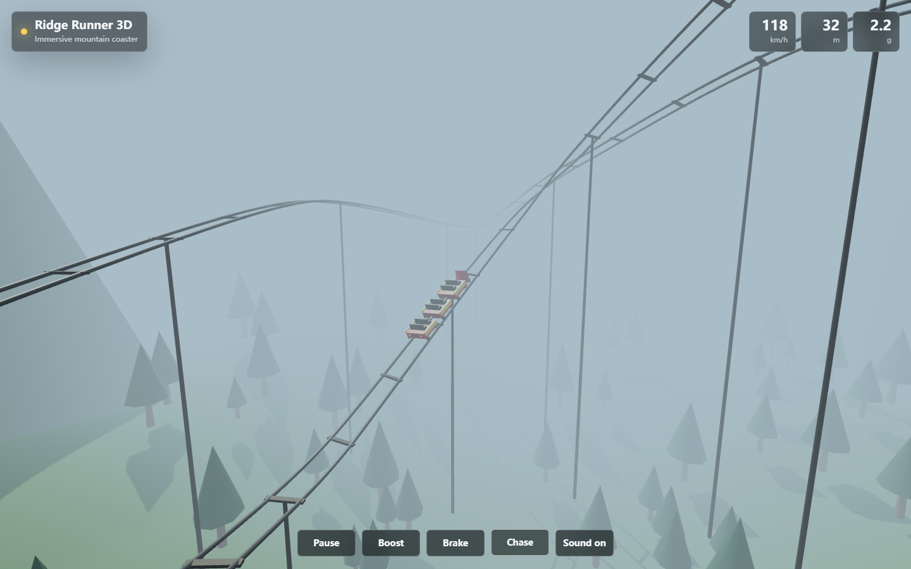

# gpt-5-5-model-test

这是 gpt5.5 模型的一次测试仓库，用于记录一次从需求到实现、调试、浏览器验证和发布说明的完整 Codex 工作流。

## 测试内容

- 使用 GPT-5.5/Codex 在本地创建一个 Three.js 3D 过山车游戏。
- 实现山地场景、雾效、轨道、列车、灯光、HUD、相机切换和基础操作。
- 优化过山车列车建模，让多节车厢沿轨道曲线独立转向。
- 优化轨道音效，包括风噪、轮轨低频、链条爬升声、轨道接缝声和弯道轮缘声。
- 使用浏览器自动化进行运行验证，并将仓库发布为公开仓库。

## 运行测试截图

## 验证结论

本次测试证明 GPT-5.5/Codex 可以在一个连续任务中完成以下工作：

- 搭建前端工程。
- 编写和迭代 3D 交互代码。
- 根据浏览器截图反馈修复视觉问题。
- 配置开发环境与 Playwright 浏览器。
- 使用浏览器和 GitHub 完成公开仓库创建、说明补充和结果发布。

## 备注

该仓库主要用于模型能力测试与过程记录，不是正式产品项目。
